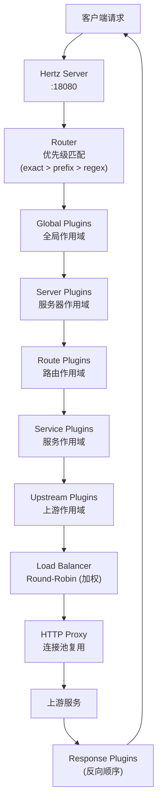
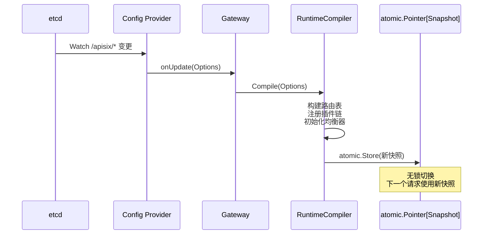
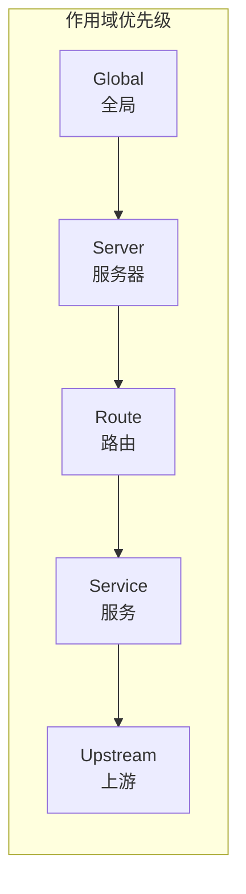
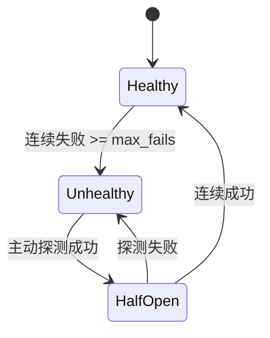
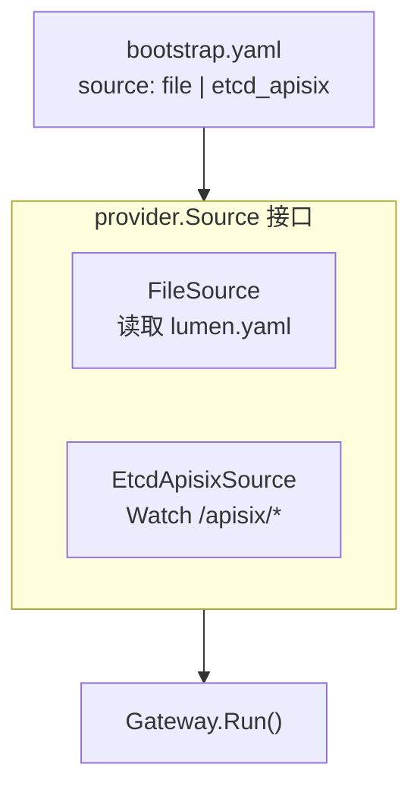

# Lumen Gateway 技术方案

## 1. 项目背景与目标

### 1.1 项目定位

Lumen Gateway 是一个高性能 L7 API 网关，基于 [Hertz](https://github.com/cloudwego/hertz)（字节跳动）+ [Netpoll](https://github.com/cloudwego/netpoll) 构建。纯 Go 实现，单一二进制部署，支持静态 YAML 配置和 etcd 动态配置，提供 APISIX 兼容的 Admin API，实现零成本从 APISIX 迁移。

### 1.2 核心目标

| 目标 | 描述 |
|------|------|
| **低尾延迟** | P99 延迟优于 APISIX，max latency 仅为 APISIX 的 58%（100 VUs） |
| **APISIX 兼容** | Admin API、etcd 数据结构、Bundle 格式完全兼容 |
| **类型安全插件** | `RegisterTypedContext[T]` 泛型注册，编译期配置校验 |
| **单一二进制** | ~15MB，无 Nginx/OpenResty/LuaJIT 依赖 |
| **热重载** | etcd watch + 原子快照切换，不中断流量 |

### 1.3 对标项目

| 项目 | 语言 | 对比 |
|------|------|------|
| [Apache APISIX](https://github.com/apache/apisix) | Lua/Nginx | Lumen 纯 Go，无 Nginx 依赖，尾延迟更低 |
| [Kong](https://github.com/Kong/kong) | Lua/Nginx | Lumen 插件模型更轻量，内置 Admin API 兼容 |
| [Tyk](https://github.com/TykTechnologies/tyk) | Go | Lumen 使用 Hertz 获得更好的 I/O 性能 |
| [Traefik](https://github.com/traefik/traefik) | Go | Lumen 提供 APISIX 兼容 Admin API，插件作用域更细粒度 |

**核心差异化**：纯 Go 实现 + APISIX 兼容 Admin API + 5 级作用域插件链 + etcd 热重载，兼顾开发体验和运维兼容性。

---

## 2. 整体架构

### 2.1 请求处理流水线



### 2.2 配置热重载



### 2.3 设计原则

| 原则 | 实现方式 |
|------|----------|
| **无锁热重载** | `atomic.Pointer[RuntimeSnapshot]` 原子指针切换 |
| **接口驱动** | Source / Store / Proxy / Balancer 全部接口抽象 |
| **编译期安全** | 插件使用泛型 `RegisterTypedContext[T]` 注册 |
| **关注点分离** | 六边形架构：gateway / router / proxy / plugin / config / adminapi |

---

## 3. 技术选型

### 3.1 核心依赖

| 组件 | 选型 | 版本 | 理由 |
|------|------|------|------|
| **HTTP 框架** | Hertz | v0.10.4 | 非阻塞 I/O + Netpoll，比 net/http 更低延迟 |
| **控制面存储** | etcd | v3.6.5 client | Watch 机制天然适合配置热推 |
| **指标采集** | Prometheus client | v1.23.2 | 生态标准，Grafana 直接对接 |
| **CLI 框架** | urfave/cli | v2.27.7 | 轻量 CLI，支持子命令 |
| **配置解析** | gopkg.in/yaml.v3 | — | Go 标准 YAML 库 |

### 3.2 未选方案

| 方案 | 未选理由 |
|------|----------|
| gin / echo | 性能不如 Hertz+Netpoll，不支持自定义 I/O 层 |
| Consul / ZooKeeper | APISIX 生态以 etcd 为标准，兼容性优先 |
| gRPC 代理 | 当前聚焦 HTTP L7，gRPC 列入后续规划 |

---

## 4. 核心模块设计

### 4.1 路由匹配引擎

**文件**: `internal/router/router.go`

**匹配优先级**（得分公式）：
```
Score = route.Priority × 1,000,000 + pathScore
```

| 匹配类型 | 路径格式 | 说明 |
|----------|----------|------|
| Exact | `= /api/v1/users` | 精确匹配，最高优先级 |
| Prefix | `/api/v1/*` | 前缀匹配 |
| Regex | `~ ^/api/v[0-9]+/` | 正则匹配 |
| Wildcard Host | `*.example.com` | 泛域名匹配 |

支持 `methods`（HTTP 方法过滤）和 `hosts`（域名过滤）两级前置条件。

### 4.2 插件系统

#### 5 级作用域



同一作用域内，按 `plugin.Metadata.Priority` 降序执行（高优先级先执行）。

#### 类型安全注册

```go
// 公开 API（plugin/plugin.go）
plugin.RegisterTypedContext[LimitCountConfig]("limit_count", func(cfg LimitCountConfig) plugin.Handler {
    // 编译期校验 LimitCountConfig 结构
    return func(ctx plugin.PluginContext) {
        // 运行时使用类型安全的 cfg
    }
})
```

#### 模板变量系统

插件参数中支持动态变量替换：

| 变量 | 来源 | 示例 |
|------|------|------|
| `$remote_addr` | 客户端 IP | `192.168.1.100` |
| `$request_id` | 请求唯一 ID | `abc123` |
| `$host` / `$uri` | 请求元数据 | `api.example.com` / `/users` |
| `$status` | 响应状态码 | `200` |
| `$upstream_response_time` | 上游耗时 | `0.045` |
| `$1` / `$2` | 正则捕获组 | 路径匹配的分组 |
| `$arg_*` | 查询参数 | `$arg_page` → `1` |
| `$http_*` | 请求头 | `$http_authorization` |

#### 9 个内置插件

| 插件 | 功能 |
|------|------|
| `request_id` | 生成/注入请求唯一 ID |
| `limit_count` | 令牌桶限流（按 Key 分桶） |
| `request_transformer` | 修改请求（method、host、headers、query） |
| `response_transformer` | 修改响应（status、body、headers） |
| `rewrite_path_regex` | 正则路径重写，支持捕获组 |
| `replace_path` | 简单路径替换 |
| `strip_prefix` | 移除路径前缀 |
| `add_prefix` | 添加路径前缀 |
| `access_log` | 访问日志，支持模板变量格式化 |

### 4.3 反向代理

**文件**: `internal/proxy/proxy.go`

**连接池配置**：
```go
Transport: &http.Transport{
    MaxIdleConns:        1024,
    MaxIdleConnsPerHost: 512,
    IdleConnTimeout:     90 * time.Second,
}
```

**请求计时（httptrace）**：


每个阶段独立计时，上报至 Prometheus histogram，支持按 `route_id`、`upstream_id`、`status_class` 分维度查询。

### 4.4 负载均衡

**接口**: `balancer/balancer.go`（公开包，支持自定义实现）

**内置实现**: 加权轮询（Round-Robin with Weight）

**健康检查**：
- **被动检查**: 统计连续失败次数，超过 `max_fails` 标记 unhealthy
- **主动检查**: 定时探测 `health_check.path`，恢复后标记 healthy
- **半开状态**: 从 unhealthy 过渡到 healthy 的中间态



### 4.5 控制面 (Admin API)

**APISIX 兼容的 CRUD**：

| 资源 | 端点 | 方法 |
|------|------|------|
| Routes | `/apisix/admin/routes[/{id}]` | GET / POST / PUT / PATCH / DELETE |
| Services | `/apisix/admin/services[/{id}]` | GET / POST / PUT / PATCH / DELETE |
| Upstreams | `/apisix/admin/upstreams[/{id}]` | GET / POST / PUT / PATCH / DELETE |
| Plugin Configs | `/apisix/admin/plugin_configs[/{id}]` | GET / POST / PUT / PATCH / DELETE |
| Global Rules | `/apisix/admin/global_rules[/{id}]` | GET / POST / PUT / PATCH / DELETE |

**控制面端点**：

| 端点 | 功能 |
|------|------|
| `GET /apisix/admin/control/schema` | 资源 schema + 插件目录 |
| `POST /apisix/admin/control/validate` | 校验单资源或 bundle |
| `POST /apisix/admin/control/imports/preview` | 预览 bundle 变更（dry run） |
| `POST /apisix/admin/control/imports/apply` | 应用 bundle（支持 prune） |
| `GET /apisix/admin/control/exports` | 导出为 JSON/YAML |
| `GET /apisix/admin/control/history` | 变更历史（默认 10 条） |
| `POST /apisix/admin/control/history/{id}/rollback` | 回滚到指定版本 |
| `GET /apisix/admin/control/stats` | 网关统计（请求数、错误率、Top 路由） |
| `GET /apisix/admin/control/plugins` | 插件目录 |

**认证**: `X-API-KEY` 头，开发环境默认 `local-dev-admin-key`

**Bundle 导入流程**：
1. Preview: 解析 bundle → 对比当前配置 → 返回 create/update/delete/unchanged 列表
2. Apply: 原子事务执行变更 → 保存历史快照 → 返回结果
3. 支持 `prune` 参数：删除 bundle 中未包含的资源

### 4.6 配置提供者



| 模式 | 使用场景 |
|------|----------|
| `file` | 开发/测试环境，YAML 文件定义路由 |
| `etcd_apisix` | 生产环境，Admin API 动态管理 |

---

## 5. 可观测性

### 5.1 Prometheus 指标

**插件执行**：
```
lumen_plugin_executions_total{plugin, scope, phase, route_id, service_id, upstream_id, result}
lumen_plugin_duration_seconds{...histogram buckets...}
```

**上游代理**：
```
lumen_upstream_requests_total{route_id, service_id, upstream_id, endpoint, method, status_class, error_type, reused_conn}
lumen_upstream_phase_duration_seconds{...phase: connect|tls_handshake|request_write|first_byte|response_read|total...}
```

**错误分类**: `connect_error` / `tls_error` / `write_error` / `timeout` / `read_error` / `bad_gateway`

### 5.2 Grafana 面板

预配置仪表盘包含：
- 请求速率 (RPS) 和错误率趋势
- 延迟分布 (p50/p95/p99)
- 上游连接池利用率
- 按路由/上游的延迟热图
- 插件执行耗时排行

### 5.3 GatewayStats API

`GET /apisix/admin/control/stats` 返回：
- 总请求数、4xx/5xx 错误数、错误率百分比
- Top 5 路由（按请求量排序）

---

## 6. 性能基准

### 6.1 vs Apache APISIX 3.14.1

同一 Docker bridge 网络，启用 access_log，代理至相同 Go mock server。

**恒定负载 (100 VUs, 30s)**：

| 指标 | Lumen Gateway | APISIX | 比率 |
|------|---------------|--------|------|
| RPS | 7,764 | 9,167 | 0.85x |
| 平均延迟 | 12.80 ms | 10.83 ms | 1.18x |
| P95 延迟 | 24.68 ms | 22.27 ms | 1.11x |
| P99 延迟 | 36.48 ms | 37.42 ms | **0.97x** |
| 最大延迟 | 182.83 ms | 316.17 ms | **0.58x** |
| 错误率 | 0% | 0% | — |

**递增负载 (10 → 500 VUs)**：

| 指标 | Lumen Gateway | APISIX | 比率 |
|------|---------------|--------|------|
| RPS | 7,825 | 9,662 | 0.81x |
| P99 延迟 | 88.24 ms | 86.87 ms | **1.02x** |
| 最大延迟 | 370.67 ms | 430.41 ms | **0.86x** |

**结论**：APISIX 吞吐量高 18-24%，但 Lumen Gateway 的尾延迟显著更低（max latency 低 42-58%）。500 VUs 下 P99 基本持平。

### 6.2 适用场景

| 选择 Lumen Gateway | 选择 APISIX |
|---------------------|-------------|
| 团队以 Go 为主，需要单语言栈 | 需要极致吞吐量 |
| SLA 敏感，尾延迟要求严格 | 依赖 APISIX 100+ 插件生态 |
| 需要单二进制部署，无运行时依赖 | 团队已投入 OpenResty/Lua |
| 需要类型安全的自定义插件 | 需要 Lua 热加载插件 |

---

## 7. 构建与部署

### 7.1 Dockerfile（多阶段）

```dockerfile
# Stage 1: 编译
FROM golang:1.25-alpine
RUN go build -ldflags="-s -w" -o lumen-gateway ./cmd/lumen-gateway

# Stage 2: 运行
FROM alpine:3.20
RUN adduser -D lumen
COPY --from=builder lumen-gateway /usr/local/bin/
USER lumen
EXPOSE 18080
ENTRYPOINT ["lumen-gateway", "--config", "configs/bootstrap.yaml"]
```

产物：~15MB 静态二进制，无运行时依赖。

### 7.2 运行模式

```bash
# 文件模式（开发）
./lumen-gateway --config configs/bootstrap.yaml

# etcd 模式（生产）
./lumen-gateway --config configs/bootstrap.docker.yaml

# 配置校验
./lumen-gateway --config configs/bootstrap.yaml --test

# CLI 管理
./lumen-gateway admin import --file bundle.yaml
./lumen-gateway admin export --format yaml
./lumen-gateway admin sync --watch
```

---

## 8. 代码结构

```
cmd/lumen-gateway/             入口
internal/
├── gateway/                   核心引擎（Run/Shutdown/Reload + 原子快照）
│   └── compiler.go            RuntimeCompiler（路由表/插件链/均衡器编译）
├── router/                    路由匹配（exact/prefix/regex/wildcard host）
├── proxy/                     反向代理（连接池 + httptrace 计时）
├── plugin/                    插件链引擎 + 5 级作用域
│   └── builtin/               9 个内置插件 + 模板变量解析
├── balancer/                  负载均衡接口
│   └── roundrobin/            加权轮询实现
├── health/                    被动 + 主动健康检查
├── config/                    YAML 配置解析 + 校验
├── controlplane/              etcd 存储 + 历史 + bundle 导入导出
├── adminapi/                  APISIX 兼容 Admin API（CRUD + 控制面）
├── apisix/                    APISIX 数据模型 + 反序列化
├── translate/                 APISIX 配置 → 内部配置转换
├── provider/                  配置源抽象（file / etcd_apisix）
├── observability/             Prometheus 指标录制
├── bootstrap/                 应用装配
└── runtimectx/                模板变量运行时上下文

balancer/                      公开包：Balancer 接口（支持自定义实现）
plugin/                        公开包：RegisterTypedContext[T] 注册 API

deploy/
├── prometheus/                Prometheus 采集配置
└── grafana/                   Dashboard provisioning + JSON 模型
```

---

## 9. 关键设计决策

| 决策 | 理由 |
|------|------|
| **Hertz + Netpoll** vs net/http | Netpoll 的 epoll/kqueue 实现比 Go 标准库更低延迟 |
| **原子快照切换** vs 锁保护 | 无锁读路径，热重载不影响在途请求 |
| **泛型插件注册** vs 反射 | 编译期类型检查，避免运行时 panic |
| **APISIX 兼容** vs 自定义 API | 降低迁移成本，复用 APISIX 生态工具 |
| **etcd Watch** vs 轮询 | 实时推送，延迟 < 100ms |
| **httptrace 计时** vs 外部探针 | 零额外开销，内置于代理路径 |
| **Bundle 预览** vs 直接应用 | 防止误操作，CI/CD 可集成 dry-run |

---

## 10. 未来规划

| 方向 | 计划 |
|------|------|
| **gRPC 代理** | 支持 gRPC L7 代理和路由 |
| **WebSocket 代理** | 长连接代理 + 健康检查 |
| **更多内置插件** | jwt-auth、cors、proxy-cache、ip-restriction |
| **多集群同步** | 跨 etcd 集群配置同步 |
| **Wasm 插件** | 支持 WebAssembly 插件扩展 |
| **RS256 签名** | Admin API JWT 认证（当前仅 API Key） |
| **限流增强** | 滑动窗口、分布式限流（Redis） |
