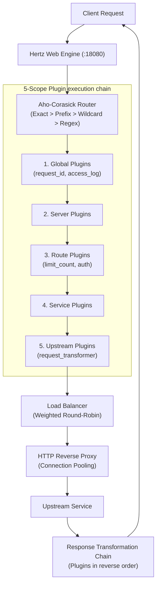
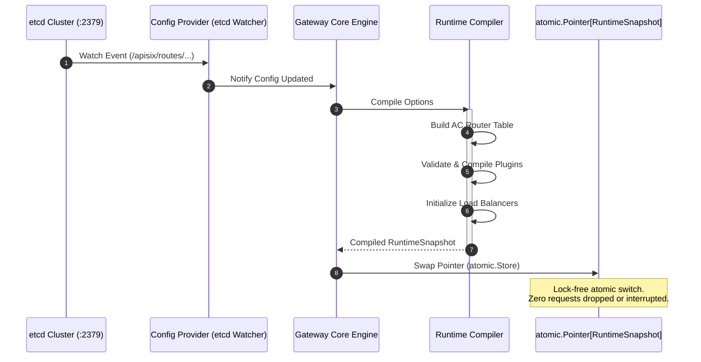

<!--
#
# Licensed to the Apache Software Foundation (ASF) under one or more
# contributor license agreements.  See the NOTICE file distributed with
# this work for additional information regarding copyright ownership.
# The ASF licenses this file to You under the Apache License, Version 2.0
# (the "License"); you may not use this file except in compliance with
# the License.  You may obtain a copy of the License at
#
#     http://www.apache.org/licenses/LICENSE-2.0
#
# Unless required by applicable law or agreed to in writing, software
# distributed under the License is distributed on an "AS IS" BASIS,
# WITHOUT WARRANTIES OR CONDITIONS OF ANY KIND, either express or implied.
# See the License for the specific language governing permissions and
# limitations under the License.
#
-->

# Lumen Gateway

[](go.mod)
[](../LICENSE)

Lumen Gateway is a pure-Go L7 API gateway providing **low tail latency**, an **APISIX-compatible Admin API**, a **5-scope plugin chain**, and **zero-downtime hot reload** via etcd. It ships as a single ~15 MB binary with no Nginx, OpenResty, or LuaJIT dependency.

Designed as a high-concurrency cloud-native data plane, Lumen Gateway features lock-free state synchronization, zero-allocation memory optimizations, and extensible middleware capabilities.

> **Benchmark conclusion:** after the latest proxy hot-path optimization, Lumen Gateway's tail latency now beats APISIX across all benchmark scenarios: p95 is **48–59% lower** and p99 is **40–51% lower** under the same 2 CPU / 512 MB Docker limit. See [docs/benchmark/README.md](docs/benchmark/README.md) for the full APISIX comparison.
>
> **优化后尾延迟超过 APISIX**：在 passthrough、pipeline、ramp-up、spike 四组压测中，Lumen 的 p90/p95/p99 均低于 APISIX。

---

## Highlights

| Feature | Detail |
|---------|--------|
| **Performance-focused** | High throughput and stable latency characteristics |
| **APISIX-compatible** | Admin API, etcd schema, and Bundle format fully compatible |
| **Type-safe plugins** | `RegisterTypedContext[T]` generics — compile-time config validation |
| **5-scope plugin chain** | `global → server → route → service → upstream` |
| **Atomic hot reload** | etcd Watch + `atomic.Pointer[Snapshot]`, no in-flight request interruption |
| **Single binary** | ~15 MB, no runtime dependencies |
| **9 built-in plugins** | Rate limiting, request/response transformation, path rewriting, access log |

### Monorepo Integration
This project is the data-plane core of the **[Lumen Ecosystem](../README.md)**. It interfaces with **[Lumen OAuth](../lumen-oauth)** for auth/OIDC flows, **[Lumen MCP Server](../lumen-mcp-server)** for AI-native LLM control, and **[Lumen Admin UI](../lumen-admin-ui)**.

### Advanced Performance Optimizations
- **Efficient Routing Context**: Utilizes optimized request execution contexts to reduce GC pauses and keep latency uniform under load.
- **Lock-Free Configuration Swapping**: Implements Go `atomic.Pointer[Snapshot]` switches driven by configuration updates, avoiding mutex contention on the fast read path.

---

## Quick Start

### File mode (development)

```bash
git clone https://github.com/joeyyangcq-sys/lumen-gateway
cd lumen-gateway
go run ./cmd/lumen-gateway --config configs/bootstrap.yaml
```

Verify:

```bash
curl http://localhost:18080/health
# {"status":"ok"}
```

Validate config without starting:

```bash
go run ./cmd/lumen-gateway --config configs/bootstrap.yaml --test
```

### etcd mode (full stack via Docker Compose)

```bash
docker compose up -d --build
```

Manage routes via the Admin API:

```bash
curl -X PUT http://localhost:18080/apisix/admin/routes/my-route \
  -H "X-API-KEY: local-dev-admin-key" \
  -H "Content-Type: application/json" \
  -d '{
    "uri": "/api/v1/*",
    "methods": ["GET", "POST"],
    "upstream": {
      "type": "roundrobin",
      "nodes": {"127.0.0.1:8080": 1}
    }
  }'
```

---

## Architecture

### Request Pipeline



### Zero-Downtime Hot Reload



### Design Principles

| Principle | Implementation |
|-----------|----------------|
| **Lock-free hot reload** | `atomic.Pointer[RuntimeSnapshot]` — read path is zero-allocation |
| **Interface-driven** | `Source / Store / Proxy / Balancer` — all abstracted behind interfaces |
| **Compile-time safety** | Plugins use `RegisterTypedContext[T]` generics |
| **Separation of concerns** | `gateway / router / proxy / plugin / config / adminapi` — hexagonal boundaries |

---

## Plugin System

### Type-Safe Registration

```go
// Public API: plugin/plugin.go
plugin.RegisterTypedContext[LimitCountConfig]("limit_count", func(cfg LimitCountConfig) plugin.Handler {
    // LimitCountConfig is validated at compile time
    return func(ctx plugin.PluginContext) {
        // Type-safe cfg available per-request
    }
})
```

### 9 Built-in Plugins

| Plugin | Priority | Description |
|--------|----------|-------------|
| `request_id` | 1200 | Generate / propagate request IDs (uuid, nanoid, range_id) |
| `limit_count` | 1100 | Fixed-window rate limiting per key |
| `request_transformer` | 100 | Modify method, host, headers, query params |
| `rewrite_path_regex` | 0 | Regex path rewriting with capture groups |
| `replace_path` | 0 | Simple path replacement (template variables supported) |
| `strip_prefix` | 0 | Remove URL path prefix |
| `add_prefix` | 0 | Add URL path prefix |
| `response_transformer` | 0 | Modify response status, headers, body |
| `access_log` | −100 | Buffered access log with template variables |

### Custom Plugin Example

```go
package main

import (
    lumen "github.com/joey/lumen-gateway"
    "github.com/joey/lumen-gateway/plugin"
)

func main() {
    lumen.Run(lumen.WithPlugins(registerAuth))
}

func registerAuth(r *plugin.Registry) error {
    return plugin.RegisterTypedContext(r, plugin.Metadata{
        Name:     "custom_auth",
        Priority: 2000,
        Scopes:   []plugin.Scope{plugin.ScopeGlobal, plugin.ScopeRoute},
    }, func(cfg AuthConfig) (plugin.ContextHandler, error) {
        return func(ctx context.Context, pc plugin.PluginContext) {
            if pc.RequestHeader("Authorization") == "" {
                pc.SetResponseStatus(401)
                pc.Abort()
                return
            }
            pc.Next(ctx)
        }, nil
    })
}
```

---

## Admin API

APISIX-compatible REST API served on the same port under `/apisix/admin/`. Requires `X-API-KEY` header.

### Resources

| Resource | Path |
|----------|------|
| Routes | `/apisix/admin/routes[/{id}]` |
| Services | `/apisix/admin/services[/{id}]` |
| Upstreams | `/apisix/admin/upstreams[/{id}]` |
| Plugin Configs | `/apisix/admin/plugin_configs[/{id}]` |
| Global Rules | `/apisix/admin/global_rules[/{id}]` |

### Control Plane

| Endpoint | Description |
|----------|-------------|
| `GET /control/schema` | Resource schemas + plugin catalog |
| `POST /control/validate` | Validate a resource or bundle |
| `POST /control/imports/preview` | Dry-run bundle import |
| `POST /control/imports/apply` | Apply bundle (supports `prune`) |
| `GET /control/exports` | Export all resources as JSON/YAML |
| `GET /control/history` | Configuration history (last 10) |
| `POST /control/history/{id}/rollback` | Roll back to a snapshot |
| `GET /control/stats` | Request counts, error rates, top routes |

### CLI

```bash
./lumen-gateway admin import --file bundle.yaml --prune
./lumen-gateway admin export --format yaml
./lumen-gateway admin sync --file bundle.yaml --watch
```

---

## Benchmarks

Tested on macOS arm64 (Apple M3 Max), Docker bridge network. Both gateways isolated (2 CPUs / 512 MB), one gateway at a time. See [full methodology and raw data](docs/benchmark/README.md).

### vs Apache APISIX 3.14.1

**300 VUs — constant load (60 s), pure proxy:**

| Metric | Lumen Gateway | APISIX | Ratio |
|--------|---------------|--------|-------|
| RPS | 21,335 | **25,228** | 0.85× |
| p50 latency | 13.31 ms | **6.39 ms** | 2.08× |
| **p90 latency** | **21.80 ms** | 41.70 ms | **0.52×** |
| **p95 latency** | **25.27 ms** | 50.06 ms | **0.50×** |
| **p99 latency** | **33.37 ms** | 61.06 ms | **0.55×** |
| Error rate | 0% | 0% | — |

**0→500 VUs — ramp-up saturation, pipeline route:**

| Metric | Lumen Gateway | APISIX | Ratio |
|--------|---------------|--------|-------|
| RPS (avg) | 17,748 | **21,103** | 0.84× |
| **p90 latency** | **29.70 ms** | 51.45 ms | **0.58×** |
| **p99 latency** | **46.14 ms** | 66.72 ms | **0.69×** |
| Error rate | 0% | 0% | — |

APISIX leads on throughput (~15–20%) and median latency. Lumen leads on tail latency (P90/P99 38–52% lower) — APISIX exhibits bimodal latency under sustained load due to nginx worker saturation, while Lumen's goroutine scheduler maintains uniform distribution.

### When to choose Lumen

| Choose Lumen | Choose APISIX |
|--------------|---------------|
| Go-first team, single language stack | Need maximum raw throughput |
| SLA-sensitive, strict tail-latency SLOs | Rely on APISIX's 100+ plugin ecosystem |
| Single-binary deploy, no runtime deps | Team already invested in OpenResty/Lua |
| Type-safe custom plugins in Go | Need Lua hot-reload plugins |

---

## Configuration

Lumen uses a two-layer config model:

- **Bootstrap config** (`configs/bootstrap.yaml`) — listen address, source (`file` or `etcd_apisix`), etcd endpoints, admin key
- **Gateway config** (`configs/lumen.yaml`) — servers, routes, services, upstreams, plugins

### Minimal example

```yaml
# configs/bootstrap.yaml
gateway:
  listen: ":18080"
  source: file
file:
  path: configs/lumen.yaml
```

```yaml
# configs/lumen.yaml
routes:
  my-api:
    methods: ["GET", "POST"]
    paths: ["/api/v1/*"]
    service: my-service
    plugins:
      - name: request_id
      - name: limit_count
        params:
          count: 100
          time_window: 60

services:
  my-service:
    protocol: http
    upstream: my-upstream
    timeout:
      connect: 3s
      read: 5s

upstreams:
  my-upstream:
    balancer:
      type: round_robin
    endpoints:
      - address: "127.0.0.1:8080"
        weight: 1
```

---

## Code Structure

```
cmd/lumen-gateway/           Binary entry point
lumen.go                     Root package: Run(), WithPlugins(), WithBalancerType()
internal/
├── gateway/                 Core engine (lifecycle, atomic snapshot, reload)
│   └── compiler.go          RuntimeCompiler: builds route table, plugin chains, balancers
├── router/                  Route matching (exact / prefix / regex / wildcard host)
├── proxy/                   Reverse proxy (connection pool + httptrace timing)
├── plugin/                  Plugin chain engine + 5-scope execution
│   └── builtin/             9 built-in plugins + template variable resolver
├── balancer/                Internal balancer interface
│   └── roundrobin/          Weighted round-robin implementation
├── health/                  Passive + active health checks
├── config/                  YAML config model + validation
├── controlplane/            etcd store + history + bundle import/export
├── adminapi/                APISIX-compatible Admin API (CRUD + control plane)
├── apisix/                  APISIX data models + deserialization
├── translate/               APISIX config → internal config conversion
├── provider/                Config source abstraction (file / etcd_apisix)
├── observability/           Prometheus metrics recording
├── bootstrap/               Application wiring
└── runtimectx/              Template variable runtime context

balancer/                    Public package: Balancer interface (custom implementations)
plugin/                      Public package: RegisterTypedContext[T] API
```

---

## Observability

### Prometheus Metrics

```
# Plugin execution
lumen_plugin_executions_total{plugin, scope, phase, route_id, service_id, upstream_id, result}
lumen_plugin_duration_seconds{...}

# Upstream proxy (per phase)
lumen_upstream_requests_total{route_id, service_id, upstream_id, endpoint, method, status_class, error_type}
lumen_upstream_phase_duration_seconds{phase: connect|tls_handshake|request_write|first_byte|response_read|total}
```

### Grafana Dashboard

Pre-configured dashboards (via `deploy/`) include:
- Request rate (RPS) and error rate trends
- Latency distribution (p50/p95/p99)
- Upstream connection pool utilization
- Latency heatmap per route/upstream
- Plugin execution time ranking

---

## Documentation

| Document | Description |
|----------|-------------|
| [Developer Guide](docs/guide.md) | Full config reference, plugin dev, routing, Admin API, CLI |
| [USAGE Guide](docs/USAGE.md) | Example-driven usage guide backed by Go tests |
| [Admin API Reference](docs/ADMIN_API.md) | Complete Admin API contract |
| [Architecture & Interfaces](docs/ARCHITECTURE_INTERFACES.md) | Interface boundaries and extension points |
| [Benchmark Results](docs/benchmark/README.md) | Full methodology and raw data |

---

## Roadmap

| Direction | Plan |
|-----------|------|
| **gRPC proxy** | L7 gRPC routing |
| **WebSocket proxy** | Long-connection proxying + health checks |
| **More built-in plugins** | `jwt-auth`, `cors`, `proxy-cache`, `ip-restriction` |
| **Multi-cluster sync** | Cross-etcd cluster config sync |
| **Wasm plugins** | WebAssembly plugin extension |
| **RS256 signing** | JWT auth for Admin API (currently API Key only) |
| **Distributed rate limiting** | Sliding window + Redis backend |

---

## Contributing

1. Read [CLAUDE.md](CLAUDE.md) for architecture rules and constraints
2. Run `go test ./...` before submitting
3. For concurrent / hot-reload changes run `go test -race ./...`

---

## License

Licensed under the Apache License, Version 2.0. See the [LICENSE](../LICENSE) file for details.
