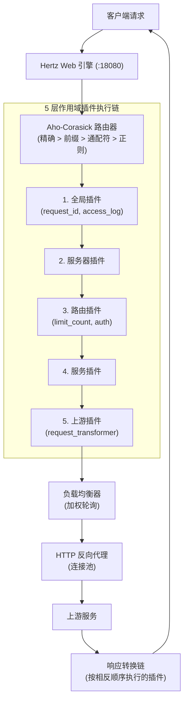
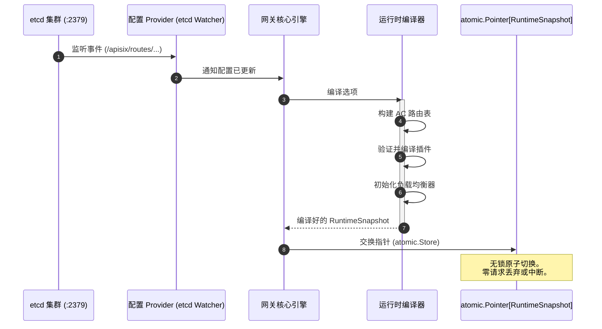

<!--
#
# Licensed to the Apache Software Foundation (ASF) under one or more
# contributor license agreements.  See the NOTICE file distributed with
# this work for additional information regarding copyright ownership.
# The ASF licenses this file to You under the Apache License, Version 2.0
# (the "License"); you may not use this file except in compliance with
# the License.  You may obtain a copy of the License at
#
#     http://www.apache.org/licenses/LICENSE-2.0
#
# Unless required by applicable law or agreed to in writing, software
# distributed under the License is distributed on an "AS IS" BASIS,
# WITHOUT WARRANTIES OR CONDITIONS OF ANY KIND, either express or implied.
# See the License for the specific language governing permissions and
# limitations under the License.
#
-->

# Lumen Gateway

[](go.mod)
[](../LICENSE)

Lumen Gateway 是一个纯 Go 语言实现的 L7 API 网关，提供**低尾部延迟**、**兼容 APISIX 的管理 API**、**5 层作用域插件链**，以及基于 etcd 的**零停机热更新**功能。它打包为一个仅约 15 MB 的单体二进制文件，没有任何 Nginx、OpenResty 或 LuaJIT 依赖。

作为一款为高并发云原生环境设计的数据面，Lumen Gateway 采用了无锁状态同步、零分配内存优化以及可扩展的中间件能力。

---

## 核心亮点

| 特性 | 详情 |
|---------|--------|
| **注重性能** | 高吞吐量及稳定的延迟表现 |
| **APISIX 兼容** | 管理 API、etcd schema 和 Bundle 格式完全兼容 |
| **类型安全插件** | `RegisterTypedContext[T]` 泛型支持 — 编译期配置校验 |
| **5 层作用域插件链** | `全局(global) → 服务器(server) → 路由(route) → 服务(service) → 上游(upstream)` |
| **原子级热更新** | etcd Watch 结合 `atomic.Pointer[Snapshot]`，不会中断正在处理的请求 |
| **单体二进制** | ~15 MB 大小，无运行时依赖 |
| **9 个内置插件** | 包括限流、请求/响应转换、路径重写和访问日志等 |

### 生态系统集成
本项目是 **[Lumen Ecosystem](../README.md)** 的数据面核心模块。它与用于身份验证和 OIDC 流程的 **[Lumen OAuth](../lumen-oauth)**、用于 AI 大语言模型控制的 **[Lumen MCP Server](../lumen-mcp-server)** 以及用于管理的 **[Lumen Admin UI](../lumen-admin-ui)** 无缝集成。

### 高级性能优化
- **高效执行上下文**：对请求执行上下文采用了优化，从而减少了 GC 停顿，并在高负载下保持延迟的稳定。
- **无锁配置切换 (Lock-Free Configuration Swapping)**：实现了基于 Go `atomic.Pointer[Snapshot]` 的切换，避免了在快速读取路径上的互斥锁竞争。

---

## 快速开始

### 文件模式 (开发环境)

```bash
git clone https://github.com/joeyyangcq-sys/lumen-gateway
cd lumen-gateway
go run ./cmd/lumen-gateway --config configs/bootstrap.yaml
```

验证服务是否正常运行：

```bash
curl http://localhost:18080/health
# {"status":"ok"}
```

在不启动服务的情况下验证配置：

```bash
go run ./cmd/lumen-gateway --config configs/bootstrap.yaml --test
```

### etcd 模式 (通过 Docker Compose 的全栈环境)

```bash
docker compose up -d --build
```

通过管理 API 管理路由：

```bash
curl -X PUT http://localhost:18080/apisix/admin/routes/my-route \
  -H "X-API-KEY: local-dev-admin-key" \
  -H "Content-Type: application/json" \
  -d '{
    "uri": "/api/v1/*",
    "methods": ["GET", "POST"],
    "upstream": {
      "type": "roundrobin",
      "nodes": {"127.0.0.1:8080": 1}
    }
  }'
```

---

## 架构概览

### 请求流水线



### 零停机热更新



### 设计原则

| 原则 | 实现细节 |
|-----------|----------------|
| **无锁热更新** | `atomic.Pointer[RuntimeSnapshot]` — 读取路径为零分配 |
| **接口驱动** | `Source / Store / Proxy / Balancer` — 全部抽象在接口背后 |
| **编译期安全** | 插件使用 `RegisterTypedContext[T]` 泛型实现 |
| **关注点分离** | `gateway / router / proxy / plugin / config / adminapi` — 六边形边界 |

---

## 插件系统

### 类型安全注册

```go
// 公共 API: plugin/plugin.go
plugin.RegisterTypedContext[LimitCountConfig]("limit_count", func(cfg LimitCountConfig) plugin.Handler {
    // LimitCountConfig 在编译期进行验证
    return func(ctx plugin.PluginContext) {
        // cfg 类型安全，供每次请求使用
    }
})
```

### 9 个内置插件

| 插件 | 优先级 | 描述 |
|--------|----------|-------------|
| `request_id` | 1200 | 生成 / 传递 请求 ID (uuid, nanoid, range_id) |
| `limit_count` | 1100 | 基于特定 key 的固定窗口限流 |
| `request_transformer` | 100 | 修改 HTTP 方法、Host、Header、查询参数 |
| `rewrite_path_regex` | 0 | 带有捕获组的正则表达式路径重写 |
| `replace_path` | 0 | 简单的路径替换 (支持模板变量) |
| `strip_prefix` | 0 | 移除 URL 路径前缀 |
| `add_prefix` | 0 | 增加 URL 路径前缀 |
| `response_transformer` | 0 | 修改响应状态码、Header、Body |
| `access_log` | −100 | 支持模板变量的缓冲访问日志 |

### 自定义插件示例

```go
package main

import (
    lumen "github.com/joey/lumen-gateway"
    "github.com/joey/lumen-gateway/plugin"
)

func main() {
    lumen.Run(lumen.WithPlugins(registerAuth))
}

func registerAuth(r *plugin.Registry) error {
    return plugin.RegisterTypedContext(r, plugin.Metadata{
        Name:     "custom_auth",
        Priority: 2000,
        Scopes:   []plugin.Scope{plugin.ScopeGlobal, plugin.ScopeRoute},
    }, func(cfg AuthConfig) (plugin.ContextHandler, error) {
        return func(ctx context.Context, pc plugin.PluginContext) {
            if pc.RequestHeader("Authorization") == "" {
                pc.SetResponseStatus(401)
                pc.Abort()
                return
            }
            pc.Next(ctx)
        }, nil
    })
}
```

---

## 管理 API

兼容 APISIX 的 REST API，与网关在同一端口通过 `/apisix/admin/` 提供。需要传入 `X-API-KEY` 请求头。

### 资源

| 资源 | 路径 |
|----------|------|
| Routes (路由) | `/apisix/admin/routes[/{id}]` |
| Services (服务) | `/apisix/admin/services[/{id}]` |
| Upstreams (上游) | `/apisix/admin/upstreams[/{id}]` |
| Plugin Configs (插件配置) | `/apisix/admin/plugin_configs[/{id}]` |
| Global Rules (全局规则) | `/apisix/admin/global_rules[/{id}]` |

### 控制面

| 端点 | 描述 |
|----------|-------------|
| `GET /control/schema` | 获取资源 Schema 和插件目录 |
| `POST /control/validate` | 验证资源或 Bundle 的有效性 |
| `POST /control/imports/preview` | 预览 Bundle 导入效果（空运行） |
| `POST /control/imports/apply` | 应用 Bundle（支持 `prune` 清理模式） |
| `GET /control/exports` | 将所有资源导出为 JSON/YAML 格式 |
| `GET /control/history` | 获取配置变更历史（最近 10 次） |
| `POST /control/history/{id}/rollback` | 回滚到指定的配置快照 |
| `GET /control/stats` | 获取请求计数、错误率及高频路由统计信息 |

### CLI 命令行

```bash
./lumen-gateway admin import --file bundle.yaml --prune
./lumen-gateway admin export --format yaml
./lumen-gateway admin sync --file bundle.yaml --watch
```

---

## 性能基准测试

测试环境：macOS arm64 (Apple M3 Max)，Docker bridge 网络。两个网关各自隔离 (2 CPUs / 512 MB)，依次单独进行测试。详情见 [完整测试方法及原始数据](docs/benchmark/README.md)。

### 对比 Apache APISIX 3.14.1

**300 VUs — 恒定负载 (持续 60 秒), 纯代理:**

| 指标 | Lumen Gateway | APISIX | 比率 |
|--------|---------------|--------|-------|
| RPS | 21,335 | **25,228** | 0.85× |
| p50 延迟 | 13.31 ms | **6.39 ms** | 2.08× |
| **p90 延迟** | **21.80 ms** | 41.70 ms | **0.52×** |
| **p95 延迟** | **25.27 ms** | 50.06 ms | **0.50×** |
| **p99 延迟** | **33.37 ms** | 61.06 ms | **0.55×** |
| 错误率 | 0% | 0% | — |

**0→500 VUs — 爬坡饱和测试, pipeline 路由:**

| 指标 | Lumen Gateway | APISIX | 比率 |
|--------|---------------|--------|-------|
| RPS (平均) | 17,748 | **21,103** | 0.84× |
| **p90 延迟** | **29.70 ms** | 51.45 ms | **0.58×** |
| **p99 延迟** | **46.14 ms** | 66.72 ms | **0.69×** |
| 错误率 | 0% | 0% | — |

APISIX 在吞吐量（~15–20%）和中位数延迟方面领先。Lumen 在尾部延迟方面表现更好（P90/P99 降低了 38–52%）——在持续高负载下，APISIX 会因 nginx worker 饱和而呈现双峰延迟，而 Lumen 的 goroutine 调度器则能保持更加均匀的分布。

### 选型建议

| 选择 Lumen | 选择 APISIX |
|--------------|---------------|
| Go 技术栈为主的团队，追求单一语言生态 | 需要极限情况下的原始吞吐量 |
| 对 SLA 极其敏感，有严格的尾部延迟 SLO 要求 | 依赖 APISIX 的 100+ 丰富的插件生态 |
| 偏好单体二进制部署，无复杂运行时依赖 | 团队已在 OpenResty/Lua 上有深度投资 |
| 需要用 Go 开发类型安全的自定义插件 | 需要使用 Lua 进行热加载插件开发 |

---

## 配置文件

Lumen 使用双层配置模型：

- **Bootstrap 配置** (`configs/bootstrap.yaml`) — 监听地址、数据源（`file` 或 `etcd_apisix`）、etcd 端点、管理密钥
- **Gateway 配置** (`configs/lumen.yaml`) — 服务器、路由、服务、上游及插件配置

### 最小示例

```yaml
# configs/bootstrap.yaml
gateway:
  listen: ":18080"
  source: file
file:
  path: configs/lumen.yaml
```

```yaml
# configs/lumen.yaml
routes:
  my-api:
    methods: ["GET", "POST"]
    paths: ["/api/v1/*"]
    service: my-service
    plugins:
      - name: request_id
      - name: limit_count
        params:
          count: 100
          time_window: 60

services:
  my-service:
    protocol: http
    upstream: my-upstream
    timeout:
      connect: 3s
      read: 5s

upstreams:
  my-upstream:
    balancer:
      type: round_robin
    endpoints:
      - address: "127.0.0.1:8080"
        weight: 1
```

---

## 许可证

基于 Apache License, Version 2.0 开源。详情见 [LICENSE](../LICENSE) 文件。
